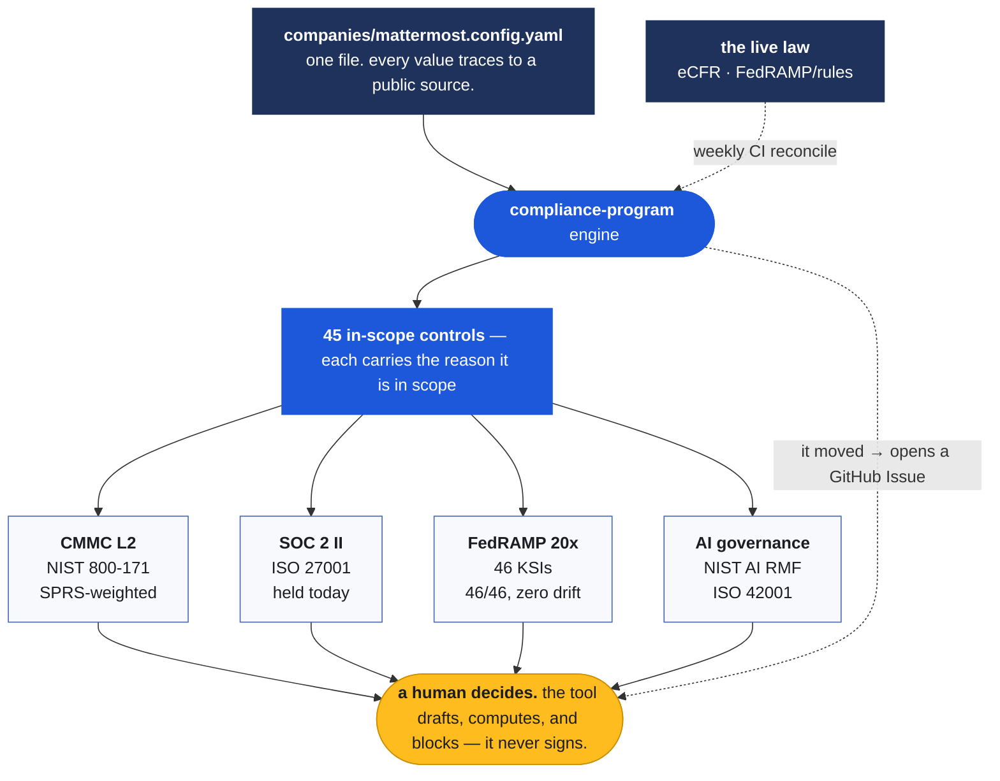

# Mattermost, onboarded

**Describes Mattermost in one config file, renders it into a working GRC program, and ships four instruments that run against Mattermost's live public surface. One of them found a defect in the published answer bank. It runs in about a second.**

[](../../actions/workflows/affirmation-gate.yml)
[](../../actions/workflows/fedramp-rules-drift.yml)
[](findings/)
[](https://github.com/tiffanidickerson437-lang/compliance-program)

This is how I'd start the GRC Manager role, built entirely from what Mattermost already publishes. It exists so the thinking is visible up front, and so a conversation can be about the parts that can't be seen from outside.

The program is further along than most at this stage. The certifications are held, the handbook is genuinely docs-as-code, and Mattermost's engineers have already written a human-in-the-loop AI model worth adopting rather than reinventing. Where this points at a gap, it means the next piece of work — never a knock on the work already done.

### The short version, in four lines

- **The published answer bank has a live defect.** It's findable from outside, and the linter that catches the whole class ships here. It runs against the live page today.
- **The first success metric was destabilized 11 days after the req posted.** The 90-day plan forks three ways and stays identical until ~day 75 whichever way September breaks.
- **One control set already renders CMMC, SOC 2, ISO 27001, FedRAMP KSIs, and AI governance.** Adding a framework is a mapping, not a project — that's how a one-analyst function scales.
- **Every checker here is tested by attacking it.** Gut any one of them to always-pass and its own suite turns red.

## What it does



Change the config, the program re-renders. Framework choice becomes a rendering rather than a bet — CMMC, SOC 2 and FedRAMP are the same controls in the language each audience needs. Keeping every rendering true as the audience changes *is* program ownership.

## Start here: the quick win

Mattermost publishes its customer-questionnaire [answer bank](https://handbook.mattermost.com/operations/operations/company-policies/security-policies) in the open — ~80 questions, clean markdown. Good material. It's also **96% "Yes."**

Governance question 8 asks whether internet-facing privileged accounts contain PII, SSNs, or patient health records. The published answer is **"Yes"** — a question where Yes is a disclosure, sitting in a long run of questions where Yes is the good answer. It contradicts question 9 directly beneath it, which says all PII is encrypted.

Mattermost has already diagnosed why this kind of thing survives. [*How Tool Sprawl Creates Security Vulnerabilities Through Cognitive Overload*](https://mattermost.com/blog/how-tool-sprawl-creates-security-vulnerabilities/) argues that people aren't careless — they get pushed past their cognitive limits until the brain becomes "the weakest link in the security chain." A column of eighty Yeses is that argument in miniature. No reviewer's eye survives it, the file has no CODEOWNER, and the repo has no merge gate, so nothing else catches it either. It rarely kills a deal outright — it adds friction in one security review after another, and nobody traces the slow deal back to line 87 of a markdown file.

So this is the machine for the thing that blog post named:

```bash
pip install pyyaml
python3 deliverables/questionnaire-linter/lint_answers.py     # runs against the live page
```

```
80 questions · 96% Yes · 1 negative-polarity · 61 unclassified

2 question(s) need a human:
  [POLARITY]      Governance Q8 (NEG-PII-EXPOSURE) -> answer 'Yes'
  [CONTRADICTION] Governance Q8 (XOR-PII-EXPOSED-VS-PII-PROTECTED)
```

It never decides. Polarity is a judgment about what a question *means*, so the rules live in a [committed YAML](deliverables/questionnaire-linter/polarity-rules.yaml) the answer-owner can read and argue with. It routes a person and says why. It also reports 61 of 80 as **unclassified** rather than clean — because a linter that treats "unknown" as "fine" is the exact fail-open defect it exists to catch.

Everything here works that way: find something in the public material, build it into something that runs, let a person make the call.

## The other five findings

Each row carries the source it came from, so every one can be checked at origin.

| # | Finding | Primary source | Turns into |
|---|---|---|---|
| 01 | Policies live in Drata, not in git | [handbook policies page](https://handbook.mattermost.com/operations/security/policies) | [Drata as a gateway, not a rip-out](deliverables/README.md#6-drata-as-an-evidence-gateway--the-so-what-happens-to-drata-answer) |
| 02 | No merge gate; security isn't in CODEOWNERS | [CODEOWNERS @ 0.2.1](https://github.com/mattermost/mattermost-handbook/blob/0.2.1/CODEOWNERS) | [CODEOWNERS + merge-gate patch](deliverables/codeowners-merge-gate/) |
| 03 | No internal AI policy, while publishing AI risk guidance for other CISOs | [llms.txt](https://handbook.mattermost.com/llms.txt) · [the CISO-facing blog](https://mattermost.com/blog/sovereign-ai-risk-assessment-ciso-questions/) | [AI policy in Mattermost's own vocabulary](deliverables/README.md#2-internal-ai-policy-written-in-their-own-vocabulary) |
| 04 | The public docs contradict each other | [certifications page](https://docs.mattermost.com/product-overview/certifications-and-compliance.html) · [federal FAQ](https://docs.mattermost.com/product-overview/faq-federal-procurement.html) | [Public claims consistency check](deliverables/public-claims-consistency/) |
| 06 | `llms.txt` publishes two conflicting trees | [handbook llms.txt](https://handbook.mattermost.com/llms.txt) | [Split-tree fix](deliverables/llms-txt-fix/) |

**Four of the six share one cause: a machine-readable surface that no machine checks.** The structure is already published — that's the hard part, and it's done. Nothing runs against it yet. Good problem to inherit.

Three of these aren't mockups. The handbook is open source, so the CODEOWNERS patch, the `llms.txt` fix, and the claims-consistency pass are pull requests that could be opened against [Mattermost's repos](https://github.com/mattermost) under the existing [contributor guidelines](https://github.com/mattermost/mattermost-handbook/tree/0.2.1/contributors).

## Against the five published success metrics

| Published success metric | What's in here today |
|---|---|
| CMMC L2 gap assessment + readiness roadmap in 90 days | [110-requirement 800-171 Rev 2 workbook](assessment/nist-800-171-rev2-workbook.md) with SPRS weights, plus a [90-day plan](generated/30-60-90/) that branches on the September task force |
| SOC 2 Type II + ISO 27001 cycles on time, no slippage | Both already rendered from the same 45 controls — [see them](generated/in-scope-controls.yaml) |
| Manual evidence → automated, continuously monitored controls | The [affirmation gate](assessment/affirmation-packet.md) and [FedRAMP drift check](assessment/upstream-conformance-receipt.md) run weekly in CI and open an Issue when they can't come back clean |
| Questionnaires + trust center maintained to unblock deals | [The linter](deliverables/questionnaire-linter/) — shipped, running against the live page |
| GRC team grown into a scalable, program-driven function | The engine is the leverage: a company is one config file, the tools stay upstream in [`compliance-program`](https://github.com/tiffanidickerson437-lang/compliance-program) |

### The one that moved under the role

The first metric was written on or before 2 July. On 13 July the DoW CIO [suspended CMMC Phase II](https://dowcio.war.gov/CMMC/) — the phase scheduled for 10 November 2026 that would have made third-party C3PAO assessment a condition of award. Suspended is not repealed, and Phase 1 is untouched: live since November 2025, NIST 800-171 Rev 2 and DFARS 7012 still enforced, Level 1 and Level 2 **self**-assessments posted to SPRS still a live contract gate, and a named senior executive still signing the [32 CFR 170.22](https://www.ecfr.gov/current/title-32/subtitle-A/chapter-I/subchapter-G/part-170/subpart-D/section-170.22) affirmation every year under False Claims Act liability.

So nothing was taken away. The outside check that was about to arrive is now prohibited from being required at all, which leaves the self-assessment — and the signature on it — as the entire control. **That makes the work heavier, not lighter.** The deliverable shifts from *get ready for an auditor* to *produce a score every line of which could be handed to the government tomorrow*. The Reform Task Force reports around 11 September — roughly week two of a September start.

That's why the [affirmation gate](assessment/affirmation-packet.md) is a computation instead of a July spreadsheet. It reads 32 CFR 170 on every run, so the week the rule moves, it goes red. It never signs — the regulation gives that act to a person. And it fails closed: an unknown control state, an expired POA&M, or a regulation it can't reach all block.

Where CMMC actually stands is the first thing worth settling. That's [question 1](findings/open-questions.md).

## Ground rules

1. **Public sources only.** Every claim traces to a public primary source checked 17 July 2026. Nothing is claimed about Mattermost's internal posture; where something couldn't be verified, it's flagged as an [open question](findings/open-questions.md).
2. **Gaps are the work, never the criticism.** If it's visible from outside, it's visible to an auditor, a customer's security team, and a competitor.
3. **Evidence is computed, never authored.** No Mattermost evidence exists in this repo and none is claimed. The `evidence_in_repo: none` line in the config is load-bearing.

## Where to look

| | |
|---|---|
| [`findings/`](findings/) | What's observably true, with verbatim evidence — plus the [open questions](findings/open-questions.md) that can't be resolved from outside |
| [`deliverables/`](deliverables/) | What the findings turned into. Eight, scored buildable-today or needs-day-one. One shipped |
| [`assessment/`](assessment/) | The federal instruments: affirmation gate, 800-171 workbook, KSI map, drift check |
| [`runbooks/`](runbooks/) | Executable procedures: L2 self-assessment under the suspension, CCM pilot, customer-assurance pass, internal AI policy |
| [`generated/`](generated/) | What the engine rendered, including the [first 90 days](generated/30-60-90/) mapped to the five metrics |
| [`context/`](context/) | The regulatory clock, the Mattermost GitHub org mapped, the framework landscape |

## Run it

```bash
pip install pyyaml

# the findings, turned into things that run
python3 deliverables/questionnaire-linter/lint_answers.py     # the live answer bank
python3 assessment/data/affirmation_gate.py --state assessment/data/examples/worked-example.state.yaml
python3 assessment/data/upstream_drift.py                     # vs FedRAMP's live ruleset
python3 assessment/data/brilliant_basics.py                   # vs the DoW CIO's own Top 10

# every checker, attacked
python3 deliverables/questionnaire-linter/test_lint_answers.py   # 16 tests
python3 assessment/data/test_affirmation_gate.py                 # 15 tests
python3 assessment/data/test_upstream_drift.py                   #  9 tests
python3 assessment/data/test_brilliant_basics.py                 # 15 tests
```

Same config, same library, same output every run.

---

Happy to walk through any of it. The first move in the seat would be turning those [open questions](findings/open-questions.md) into a 90-day plan agreed in writing — starting with where CMMC really stands and how the September report changes the target.

— Tiffani Dickerson · [compliance-program engine](https://github.com/tiffanidickerson437-lang/compliance-program)
